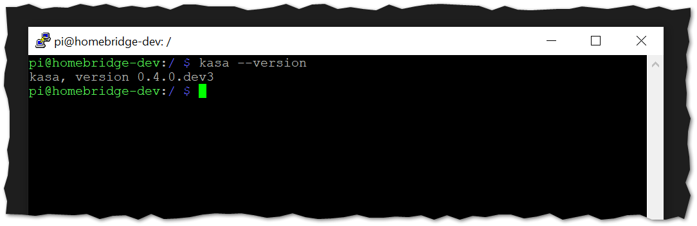

<p align="center">
    <a href="https://homebridge.io/"></a>
</p>

[](https://github.com/steveredden/homebridge-kasa-lightstrip/blob/main/LICENSE)
[](https://github.com/steveredden/homebridge-kasa-lightstrip)
[](https://GitHub.com/steveredden/homebridge-kasa-lightstrip/issues/)
[](https://npmjs.com/package/homebridge-kasa-lightstrip)
[](https://www.npmjs.com/package/homebridge-kasa-lightstrip)

# homebridge-kasa-lightstrip

`homebridge-kasa-lightstrip` is a [Homebridge](https://homebridge.io) plugin that exposes tp-link kasa light strip devices to [Apple's](https://www.apple.com) [HomeKit](https://www.apple.com/ios/home) smart home platform.

This plugin was developed as a stop-gap to provide integration of Kasa's light strips, while the [far superior] plugin ([homebridge-tplink-smarthome](https://github.com/plasticrake/homebridge-tplink-smarthome#readme)) lacks support!

This plugin creates Lightbulb accessories for you to integrate with your lightstrips.  It can also, optionally, create stateless Switch accessories to enable Light Effects.

## Prerequisites

The [python-kasa](https://github.com/python-kasa/python-kasa) library is required for this plugin.  Credit to that team and the maintainers! :trophy::clap:

Installation instructions for [Homebridge Raspberry Pi Image](https://github.com/homebridge/homebridge-raspbian-image/wiki/Getting-Started):

```sh
sudo apt install python3-pip
sudo pip3 install python-kasa --pre
```

#### Validation

You can validate that the `python-kasa` library is installed by executing `kasa --help` at the command line of your environment:



You should see something similar the above output.  If you do not, and you see something like `-bash: kasa: command not found`, you will need to install it (instructions above), or find a way to get it into your environment.  Review the [python-kasa](https://github.com/python-kasa/python-kasa#readme) repository for any additional instructions.

## Installation Instructions

#### Option 1: Install via Homebridge Config UI X

Search for "kasa" in [homebridge-config-ui-x](https://github.com/oznu/homebridge-config-ui-x) and install `homebridge-kasa-lightstrip`.

#### Option 2: Manually Install

```sh
sudo npm install -g homebridge-kasa-lightstrip
```

## Supported Devices

### Kasa Light Strips

* [KL400L5](https://www.kasasmart.com/us/products/smart-lighting/product-kl400l5)
* [KL430](https://www.kasasmart.com/us/products/smart-lighting/kasa-smart-led-light-strip-kl430)

## Configuration

Device names and IP Addresses must be configured manually in current state:

### Example

```json
platforms: [
    {
        "platform": "HomebridgeKasaLightstrip",
        "accessories": [
            {
                "name": "Couch Strip",
                "ip": "10.10.10.10",
                "effects": {
                    "Aurora": true,
                    "Hanukkah": true,
                    "CustomEffects": [
                        {
                            "name": "MyCustomEffect1",
                            "json": "{'custom':1,'id':'xqUxDhbAhNLqulcuRMyPBmVGyTOyEMEu','brightness':100,'name':'MyCustomEffect1','segments':[0],'expansion_strategy':1,'enable':1,'type':'sequence','duration':0,'transition':1500,'direction':4,'spread':7,'repeat_times':0,'sequence':[[120,100,100],[240,100,100],[260,100,100],[280,100,100]]}"
                        }
                    ]
                }
            }
        ],
        "debug": false,
        "name": "KasaLightstrip"
    }
]
```

* **platform** (mandatory): the name of this
* **accessories** (mandatory): array containing the devices and their info:
  * **name** (mandatory): the name of the accessory to create
  * **ip** (mandatory): the IP address of the device
  * *effects* (optional): object containing any effects to create:
    * *\<effectName\>* (optional): boolean to enable a specific built-in effect
    * *CustomEffects* (optional): array containing any custom effects to create:
      * *name* (optional): the name of the custom effect
      * *json* (optional): the json for the custom effect*
* *name* (optional): platform name to display in logs
* *debug* (optional): boolean to enable more verbose logging

### Lighting Effects

Stateless Switches (they turn off after 1 second) are created if you include any of the `effects` object in your `config.json`.  All 14 pre-defined Lighting Effects are available to be created and toggled for any Lightstrip you configure.  Additionally, custom Lighting Effects can be created.

\*see [CustomLightingEffects.md](docs/CustomLightingEffects.md) for more information

## Characteristic Errors

Erorrs may common due to the nature of the implementation:  Flooding your devices with rapid `python-kasa` calls may result in several dropped connections.

It is most often seen with the Brightness slider -> as you slide, the Home app can send numerous Brightness values, resulting in numerous `kasa` executions.  You'll see the following displayed in the log:

```sh
[KasaLightstrip] StripName - Error setting characteristic 'Brightness'
```

Attempt to slow your inputs! :thinking:  Or speed your swipe?! :man_shrugging:
<br><hr><br>
<p align="center">
    <a href="https://buymeacoffee.com/steveredden"></a>
</p>
