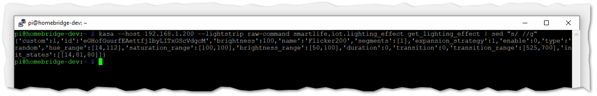
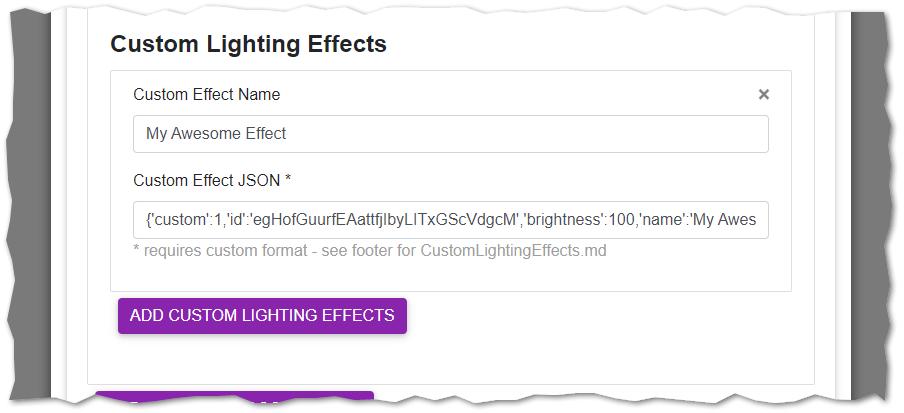
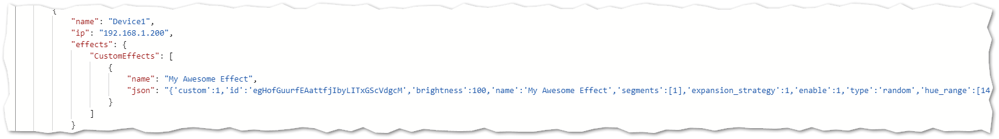

# Custom Lighting Effects

## Procedure

Create a Custom Effect in the Kasa app, or consider trying to [build your own](#BYOE) programmatically.  Set the strip to be actively using your Custom Effect.

Once your Effect is running, to retrieve a properly-formatted JSON string you will need to execute the following command in your environment.  Make sure your environment has the [python-kasa](https://github.com/python-kasa/python-kasa#readme) library installed (validate your installation [here](README.md#Validation)).  Then execute the following:


```sh
kasa --host "yourIP" --lightstrip raw-command smartlife.iot.lighting_effect get_lighting_effect | sed "s/ //g"
```

...replacing `yourIP` with the actual IP address:



The output should be pasted into your `Custom Effects JSON` field:

#### Using homebridge-ui:



#### ...or manually in your config.json:



## Removing a Custom Effect

I haven't found a great way to programmatically check if a once-added Custom Effect has been removed.  For now, the bestion option is to manually removed the cached accessory from the `Homebridge Settings` > `Remove Single Cached Accessory`.  Similarly, de-selecting one of the built-in Effects will set your `config.json` to `false`, and the device will be removed; however, if you outright remove the line items in your `config.json` the plugin is not prompted to remove it.  Again, manually remove via the `Remove Single Cached Accessory` menus.

## BYOE

### Build-Your-Own-Effect

It seems like you don't need to have actually created a Custom Effect in the Kasa app for it to work, and you can just shove a properly formatted JSON string at the `set_lighting_effect` service.  YMMV :truck:
<br><hr><br>
<p align="center">
    <a href="https://buymeacoffee.com/steveredden"></a>
</p>
