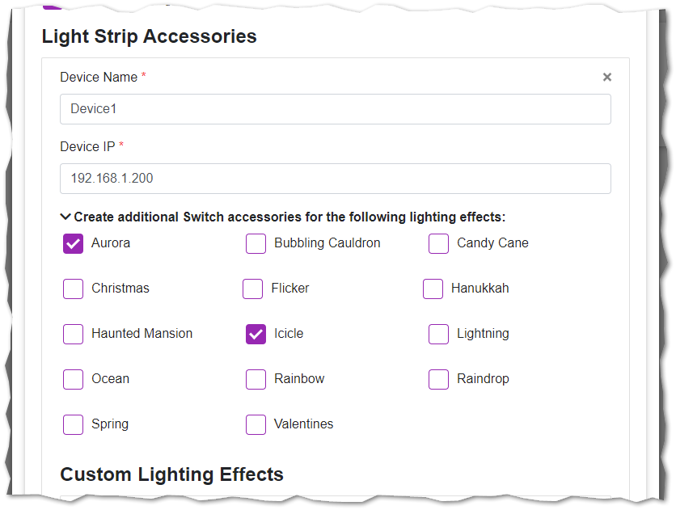
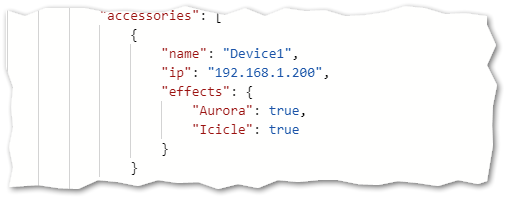

# Lighting Effects

## Built-in Lighting Effects

The following Kasa-released effects are created by editing your configuration:

<table>
  <tr><td><code>Aurora</code></td><td><code>Bubbling Cauldron</code></td><td><code>Candy Cane</code></td></tr>
  <tr><td><code>Christmas</code></td><td><code>Flicker</code></td><td><code>Hanukkah</code></td></tr>
  <tr><td><code>Haunted Mansion</code></td><td><code>Icicle</code></td><td><code>Lightning</code></td></tr>
  <tr><td><code>Ocean</code></td><td><code>Rainbow</code></td><td><code>Raindrop</code></td></tr>
  <tr><td><code>Spring</code></td><td><code>Valentines</code></td><td>&nbsp;</td></tr>
</table>

#### Using homebridge-ui:



#### ...or manually in your config.json:



## Procedure for Custom Effects

To create "buttons" for Custom Effects you need to do the following:

1. Set the strip to be actively using your Custom Effect.  
   * *Use an existing Custom Effect or create one in the Kasa app, or even consider trying to [build your own](#BYOE) programmatically*
1. Execute the below command ...replacing `yourIP` with the device's IP address:
   * *Make sure your environment has the [python-kasa](https://github.com/python-kasa/python-kasa#readme) library installed (validate your installation [here](README.md#Validation))*

```sh
kasa --host "yourIP" --lightstrip raw-command smartlife.iot.lighting_effect get_lighting_effect | sed "s/ //g"
```


The output should be pasted into your `Custom Effects JSON` field:

#### Using homebridge-ui:


#### ...or manually in your config.json:


## Removing a Custom Effect

I haven't found a great way to programmatically check if a once-added Custom Effect has been removed.  For now, the bestion option is to manually removed the cached accessory from the `Homebridge Settings` > `Remove Single Cached Accessory`.  Similarly, de-selecting one of the built-in Effects will set your `config.json` to `false`, and the device will be removed; however, if you outright remove the line items in your `config.json` the plugin is not prompted to remove it.  Again, manually remove via the `Remove Single Cached Accessory` menus.

## BYOE

### Build-Your-Own-Effect

It seems like you don't need to have actually created a Custom Effect in the Kasa app for it to work, and you can just shove a properly formatted JSON string at the `set_lighting_effect` service.  YMMV :truck:
<br><hr><br>
<p align="center">
    <a href="https://buymeacoffee.com/steveredden"></a>
</p>
